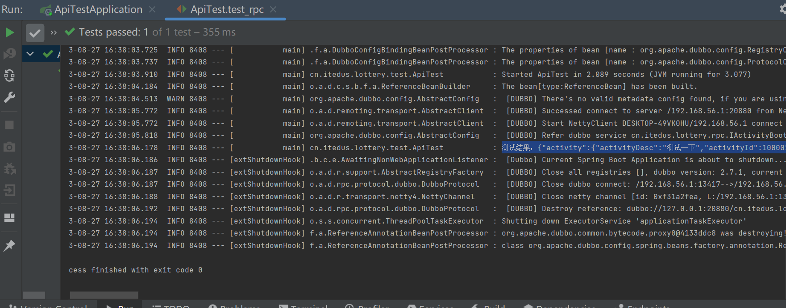
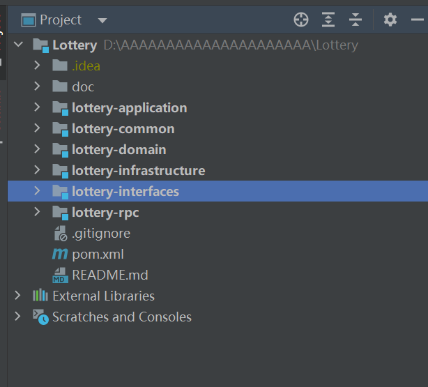

# 跑通广播模式RPC过程调用

## 跑通工程

  


## 创建抽奖活动表

* 为了将程序跑通  创建一个活动表
* 用于对数据库进行CRUD操作以及 被RPC接口调用
* 注意请在数据库添加一条记录 防止测试出现错误！！！


```sql
CREATE TABLE `activity` (
  `id` bigint(20) NOT NULL AUTO_INCREMENT COMMENT '自增ID',
  `activity_id` bigint(20) NOT NULL COMMENT '活动ID',
  `activity_name` varchar(64) CHARACTER SET utf8mb4 DEFAULT NULL COMMENT '活动名称',
  `activity_desc` varchar(128) CHARACTER SET utf8mb4 DEFAULT NULL COMMENT '活动描述',
  `begin_date_time` datetime DEFAULT NULL COMMENT '开始时间',
  `end_date_time` datetime DEFAULT NULL COMMENT '结束时间',
  `stock_count` int(11) DEFAULT NULL COMMENT '库存',
  `take_count` int(11) DEFAULT NULL COMMENT '每人可参与次数',
  `state` tinyint(2) DEFAULT NULL COMMENT '活动状态：1编辑、2提审、3撤审、4通过、5运行(审核通过后worker扫描状态)、6拒绝、7关闭、8开启',
  `creator` varchar(64) CHARACTER SET utf8mb4 DEFAULT NULL COMMENT '创建人',
  `create_time` datetime DEFAULT CURRENT_TIMESTAMP COMMENT '创建时间',
  `update_time` datetime DEFAULT CURRENT_TIMESTAMP COMMENT '修改时间',
  PRIMARY KEY (`id`),
  UNIQUE KEY `unique_activity_id` (`activity_id`)
) ENGINE=InnoDB AUTO_INCREMENT=2 DEFAULT CHARSET=utf8mb4 COLLATE=utf8mb4_bin COMMENT='活动配置';

```

* 活动表：是一个用于配置抽奖活动的总表，用于存放活动信息，包括：ID，名称，描述，时间，库存，参与次数等


## pom文件配置

* lottery-applicatio,应用层  引用:domain
* lottery-common,通用包，引用：无
* lottery-domain,领域层，引用：infrastructure
* lottery-infrastructure,基础层 引用无
* lottery-interfaces 接口层 引用 application rpc
* lottery-rpc, RPC接口定义层引用common

* 在分层结构和依赖引用下，各级模块不能循环依赖，同时lottery-interfaces作为系统的war包工程，在构建工程时，需要依赖pom中配置的相关信息，那就注意下作为Lottery工程下的主pom.xml需要完成对SpringBoot父文件的依赖，此外还需要定义一些用于其他模块可以引入的配置信息，比如jdk版本，编码方式等，对于其他层依赖于总pom文件 还需要配置自己的信息

### 总工程配置


```xml

<?xml version="1.0" encoding="UTF-8"?>
<project xmlns="http://maven.apache.org/POM/4.0.0"
         xmlns:xsi="http://www.w3.org/2001/XMLSchema-instance"
         xsi:schemaLocation="http://maven.apache.org/POM/4.0.0 http://maven.apache.org/xsd/maven-4.0.0.xsd">
    <modelVersion>4.0.0</modelVersion>

    <groupId>cn.itedus.lottery</groupId>
    <artifactId>Lottery</artifactId>
    <packaging>pom</packaging>
    <version>1.0-SNAPSHOT</version>

    <modules>
        <module>lottery-application</module>
        <module>lottery-domain</module>
        <module>lottery-infrastructure</module>
        <module>lottery-interfaces</module>
        <module>lottery-rpc</module>
        <module>lottery-common</module>
    </modules>

    <properties>
        <!-- Base -->
        <jdk.version>1.8</jdk.version>
        <sourceEncoding>UTF-8</sourceEncoding>
    </properties>

    <parent>
        <groupId>org.springframework.boot</groupId>
        <artifactId>spring-boot-starter-parent</artifactId>
        <version>2.3.5.RELEASE</version>
        <relativePath/> <!-- lookup parent from repository -->
    </parent>

    <build>
        <plugins>
            <plugin>
                <groupId>org.apache.maven.plugins</groupId>
                <artifactId>maven-surefire-plugin</artifactId>
                <version>2.20</version>
                <configuration>
                    <skipTests>true</skipTests>
                </configuration>
            </plugin>
            <plugin>
                <groupId>org.apache.maven.plugins</groupId>
                <artifactId>maven-compiler-plugin</artifactId>
                <configuration>
                    <source>8</source>
                    <target>8</target>
                </configuration>
            </plugin>
        </plugins>
    </build>

</project>

```

* artifactId表示这是SpringBoot的一个起始夫项目
* version表示版本号
* parent表示当前项目将从一个父项目继承属性和配置，这是一种在多个项目之间管理共同配置的方式
* starter是一个启动器，这个启动器会自动依赖其他组件，迅速获取与spring有关的组件
* spring-boot-starter-parent 可以统一控制版本
* 使用Java编译、打包版本 指定JDK版本
* 指定编码 UTF-8
* 识别过来资源过滤
* spring-boot-starter-parent 会有很多默认的依赖包的版本
* 引入这个依赖就不需要其他依赖包指定版本了，都有默认的版本，不需要考虑依赖包的版本
* 相对于其他模块来说，总的pom文件就是这些模块的父类模块，在父类模块中一般只提供基础的定义，不提供各个Jar包的引入配置
* 如果在父类POM中引入了所有的Jar,那么各个模块无论是否需要这个Jar都会被自动引入进去，造成没有必要的配置
* 指定项目的子模块列表 这些子模块都是独立的Maven项目
* properties指定项目属性  jdk版本和源代码编码
* MAVEN插件配置
* plugins表示插件配置的容器 这里有两个插件配置

  

### 模块类POM配置

* parent指定当前项目模块的夫项目
* artifactId指定当前模块的名称
* packing指定当前项目模块的打包类型 jar
* dependency表示当前模块的项目依赖 依赖common
* 项目配置一个MAVEN模块


```xml
<parent>
    <artifactId>Lottery</artifactId>
    <groupId>cn.itedus.lottery</groupId>
    <version>1.0-SNAPSHOT</version>
</parent>
<modelVersion>4.0.0</modelVersion>
<artifactId>lottery-rpc</artifactId>

<packaging>jar</packaging>

<dependencies>
    <dependency>
        <groupId>cn.itedus.lottery</groupId>
        <artifactId>lottery-common</artifactId>
        <version>1.0-SNAPSHOT</version>
    </dependency>
</dependencies>

<build>
    <finalName>lottery-rpc</finalName>
    <plugins>
        <!-- 编译plugin -->
        <plugin>
            <groupId>org.apache.maven.plugins</groupId>
            <artifactId>maven-compiler-plugin</artifactId>
            <configuration>
                <source>${jdk.version}</source>
                <target>${jdk.version}</target>
                <compilerVersion>1.8</compilerVersion>
            </configuration>
        </plugin>
    </plugins>
</build>


```


### war包 pom配置

* lottery-interfaces是整个程序的出口，也是用于构建war包的工程模块，所以看到<packing>war</packing>的配置
* 在dependencies会包含所有需要用到的SpringBoot配置 也会包括对其他各个模块的引入
* 在build构建配置上还会看到关于一些测试包的处理

```java
<artifactId>lottery-interfaces</artifactId>

<packaging>war</packaging>

<dependencies>
    <dependency>
        <groupId>org.springframework.boot</groupId>
        <artifactId>spring-boot-starter-web</artifactId>
    </dependency>
    ...
</dependencies>

<build>
    <finalName>Lottery</finalName>
    <resources>
        <resource>
            <directory>src/main/resources</directory>
            <filtering>true</filtering>
            <includes>
                <include>**/**</include>
            </includes>
        </resource>
    </resources>
    <testResources>
        <testResource>
            <directory>src/test/resources</directory>
            <filtering>true</filtering>
            <includes>
                <include>**/**</include>
            </includes>
        </testResource>
    </testResources>
    <plugins>
        <plugin>
            <groupId>org.springframework.boot</groupId>
            <artifactId>spring-boot-maven-plugin</artifactId>
        </plugin>
        <plugin>
            <groupId>org.apache.maven.plugins</groupId>
            <artifactId>maven-compiler-plugin</artifactId>
            <configuration>
                <source>8</source>
                <target>8</target>
            </configuration>
        </plugin>
    </plugins>
</build>
```


### 配置Mybatis

* 引入starter
* artifactId指定当前模块的名称
* spring-boot-starter-web是用来构建基于SpringBoot 的Web应用程序的库
* mysql-connector-java是用于MySQL数据库用来进行交互的驱动程序
* scope元素指定依赖的范围，这里有些依赖是test范围 表示旨在测试的时候使用
* build表示配置项目的构建信息
* finalName定义项目构建输出的最终文件名
* resoures指定项目的资源文件目录
* testResources指定测试资源文件目录
* plugins包含构建插件的配置信息
* spring-boot-maven-plugin是一个Spring Boot专用的MAVEN插件，用来构建Spring BOOT应用
* MAVEN-compiler-plugin适用于配置Java编译器的插件，这里指定编译源代码的版本为Java8

```java
<?xml version="1.0" encoding="UTF-8"?>
<project xmlns="http://maven.apache.org/POM/4.0.0"
         xmlns:xsi="http://www.w3.org/2001/XMLSchema-instance"
         xsi:schemaLocation="http://maven.apache.org/POM/4.0.0 http://maven.apache.org/xsd/maven-4.0.0.xsd">
    <parent>
        <artifactId>Lottery</artifactId>
        <groupId>cn.itedus.lottery</groupId>
        <version>1.0-SNAPSHOT</version>
    </parent>
    <modelVersion>4.0.0</modelVersion>

    <artifactId>lottery-interfaces</artifactId>

    <packaging>war</packaging>

    <dependencies>
        <dependency>
            <groupId>org.springframework.boot</groupId>
            <artifactId>spring-boot-starter-web</artifactId>
        </dependency>
        <dependency>
            <groupId>org.springframework.boot</groupId>
            <artifactId>spring-boot-starter-test</artifactId>
            <scope>test</scope>
        </dependency>
        <dependency>
            <groupId>org.mybatis.spring.boot</groupId>
            <artifactId>mybatis-spring-boot-starter</artifactId>
            <version>2.1.4</version>
        </dependency>

        <dependency>
            <groupId>mysql</groupId>
            <artifactId>mysql-connector-java</artifactId>
            <version>8.0.22</version>
        </dependency>

        <dependency>
            <groupId>com.alibaba</groupId>
            <artifactId>fastjson</artifactId>
            <version>1.2.58</version>
        </dependency>
        <dependency>
            <groupId>org.apache.commons</groupId>
            <artifactId>commons-lang3</artifactId>
            <version>3.8</version>
        </dependency>
        <dependency>
            <groupId>junit</groupId>
            <artifactId>junit</artifactId>
            <version>4.12</version>
            <scope>test</scope>
        </dependency>
        <dependency>
            <groupId>org.apache.dubbo</groupId>
            <artifactId>dubbo</artifactId>
            <version>2.7.1</version>
        </dependency>
        <dependency>
            <groupId>org.apache.dubbo</groupId>
            <artifactId>dubbo-spring-boot-starter</artifactId>
            <version>2.7.1</version>
        </dependency>
        <dependency>
            <groupId>cn.itedus.lottery</groupId>
            <artifactId>lottery-infrastructure</artifactId>
            <version>1.0-SNAPSHOT</version>
        </dependency>
        <dependency>
            <groupId>cn.itedus.lottery</groupId>
            <artifactId>lottery-rpc</artifactId>
            <version>1.0-SNAPSHOT</version>
        </dependency>
    </dependencies>

    <build>
        <finalName>Lottery</finalName>
        <resources>
            <resource>
                <directory>src/main/resources</directory>
                <filtering>true</filtering>
                <includes>
                    <include>**/**</include>
                </includes>
            </resource>
        </resources>
        <testResources>
            <testResource>
                <directory>src/test/resources</directory>
                <filtering>true</filtering>
                <includes>
                    <include>**/**</include>
                </includes>
            </testResource>
        </testResources>
        <plugins>
            <plugin>
                <groupId>org.springframework.boot</groupId>
                <artifactId>spring-boot-maven-plugin</artifactId>
            </plugin>
            <plugin>
                <groupId>org.apache.maven.plugins</groupId>
                <artifactId>maven-compiler-plugin</artifactId>
                <configuration>
                    <source>8</source>
                    <target>8</target>
                </configuration>
            </plugin>
        </plugins>
    </build>

</project>

```

### 配置yml

* 配置Spring.datasource 数据源和mybatis文件按的引入配置 这些文件主要i是包括对各个mapper的处理
* 如果是引入了分库分表组件，那么这里就需要配置多个数据源信息，在后面的开发过程中会有所体现。

```java
spring:
  datasource:
    username: root
    password: 1234
    url: jdbc:mysql://127.0.0.1:3306/lottery?useUnicode=true
    driver-class-name: com.mysql.jdbc.Driver

mybatis:
  mapper-locations: classpath:/mybatis/mapper/*.xml
  config-location:  classpath:/mybatis/config/mybatis-config.xml


```

### 配置广播模式 Dubbo

* RPC最早的设计和使用都是依赖于注册中心
* 将服务接口信息在程序启动的时候 推送到一个统一的注册中心，在其他需要调用RPC接口的服务上在通过注册中心的均衡算法来匹配可以连接的接口落到本地保存和更新
* 那么这样的标准的使用方式可以提供更大的连接数和更强的负载均衡使用

* name指定服务名称
* version指定版本号
* register指定了Dubbo的注册中心 
* address设置为N/A 表示不使用注册中心 采用广播方式
* scan配置扫描的基础包路径 来寻找带有Service注解的服务类进行暴露 开放
* 暴露的端口是20880
* 广播模式的配置唯一区别在于注册地址，registry.address = multicast://224.5.6.7:1234，服务提供者和服务调用者都需要配置相同的📢广播地址。或者配置为 N/A 用于直连模式使用
* protocol，配置的通信协议和端口
* scan，**相当于 Spring 中自动扫描包的地址，可以把此包下的所有 rpc 接口都注册到服务中**

```java
# Dubbo 广播方式配置
dubbo:
  application:
    name: Lottery
    version: 1.0.0
  registry:
    address: N/A #multicast://224.5.6.7:1234
  protocol:
    name: dubbo
    port: 20880
  scan:
    base-packages: cn.itedus.lottery.rpc


```
### 定义和开发 RPC 接口

* RPC接口在通信的过程 需要提供接口的描述文件 也就是服务接口的定义信息
* 我们将所有的PRC接口都放到lottery-rpc模块下，这种方式的使用让外部只依赖这样一个pom配置引入的Jar包

* 定义接口 这里先来定义一个活动展台的接口类，用于包装活动的创建、查询、修改、审核的接口
```java

public interface IActivityBooth {

    ActivityRes queryActivityById(ActivityReq req);

}
```

* 实现接口

&emsp;实现RPC接口的实现类有一个注解Service 这个注解来自于Dubbo,不要和Spring的注解混淆了！ 也就是包好这个注解的服务方法可以被注册到Dubbo。方法实现的比较简洁，对数据库进行查询 然后封装  提供DTO对象 返回res结果
* @Service：这个注解标记了这个类是一个Dubbo服务提供者，会被Dubbo框架自动扫描并暴露为可供远程调用的服务。
* @Resource：这个注解用于注入依赖，这里注入了 IActivityDao 接口的实例，用于查询活动信息。
* queryActivityById 方法：这是 IActivityBooth 接口中定义的方法的实现。它首先通过 activityDao 对象查询数据库中的活动信息，然后将查询结果转换为 ActivityDto 对象
* ActivityDto：这是一个数据传输对象，用于封装从数据库查询的活动信息
* ActivityRes：这是一个响应对象，用于封装响应结果。它包含了查询结果的状态码、状态信息以及封装的 ActivityDto 对象
* 总之，ActivityBooth 类实现了 IActivityBooth 接口，并通过注解标记为Dubbo服务提供者。它负责从数据库查询活动信息，并将查询结果转换为响应对象。这样，在Dubbo框架的帮助下，你可以将这个查询功能作为一个可远程调用的服务提供给其他模块使用。

```java
package cn.itedus.lottery.interfaces;

import cn.itedus.lottery.common.Constants;
import cn.itedus.lottery.common.Result;
import cn.itedus.lottery.infrastructure.dao.IActivityDao;
import cn.itedus.lottery.infrastructure.po.Activity;
import cn.itedus.lottery.rpc.IActivityBooth;
import cn.itedus.lottery.rpc.dto.ActivityDto;
import cn.itedus.lottery.rpc.req.ActivityReq;
import cn.itedus.lottery.rpc.res.ActivityRes;
import org.apache.dubbo.config.annotation.Service;

import javax.annotation.Resource;

/**
 * 博客：https://bugstack.cn - 沉淀、分享、成长，让自己和他人都能有所收获！
 * 公众号：bugstack虫洞栈
 * Create by 小傅哥(fustack)
 * <p>
 * 活动展台
 */
@Service
public class ActivityBooth implements IActivityBooth {

    @Resource
    private IActivityDao activityDao;

    @Override
    public ActivityRes queryActivityById(ActivityReq req) {

        Activity activity = activityDao.queryActivityById(req.getActivityId());

        ActivityDto activityDto = new ActivityDto();
        activityDto.setActivityId(activity.getActivityId());
        activityDto.setActivityName(activity.getActivityName());
        activityDto.setActivityDesc(activity.getActivityDesc());
        activityDto.setBeginDateTime(activity.getBeginDateTime());
        activityDto.setEndDateTime(activity.getEndDateTime());
        activityDto.setStockCount(activity.getStockCount());
        activityDto.setTakeCount(activity.getTakeCount());

        return new ActivityRes(new Result(Constants.ResponseCode.SUCCESS.getCode(), Constants.ResponseCode.SUCCESS.getInfo()), activityDto);
    }

}


```


