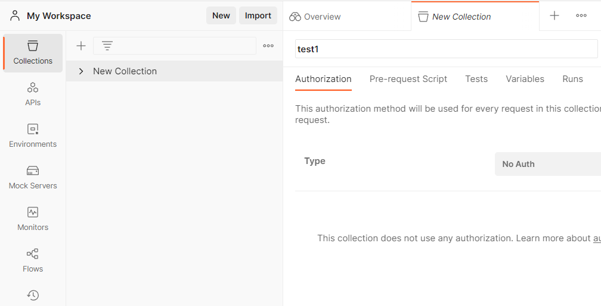
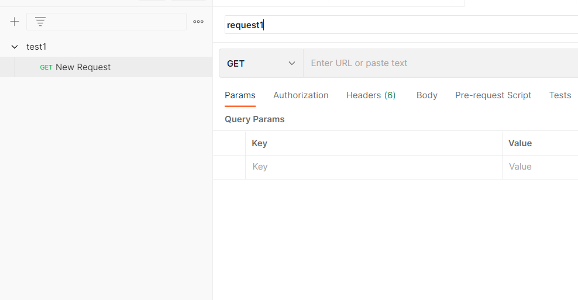
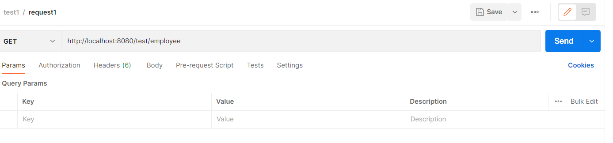
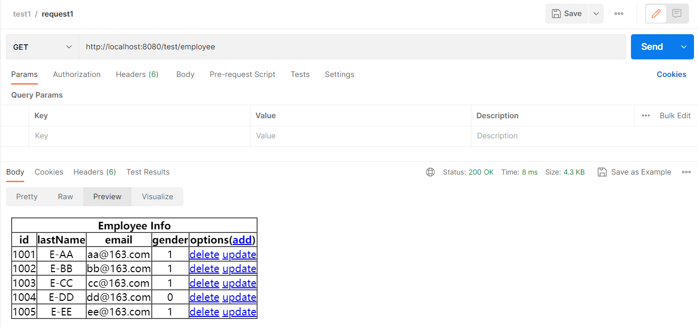
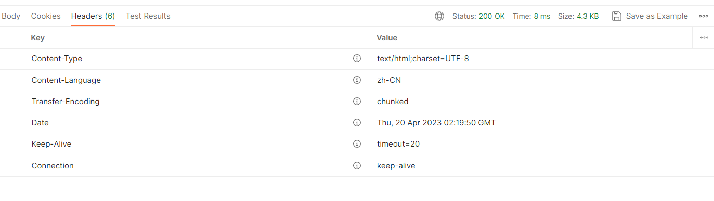
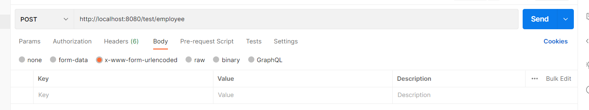
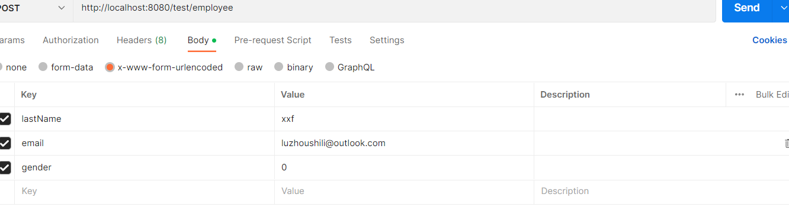
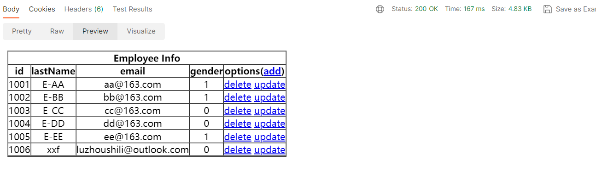
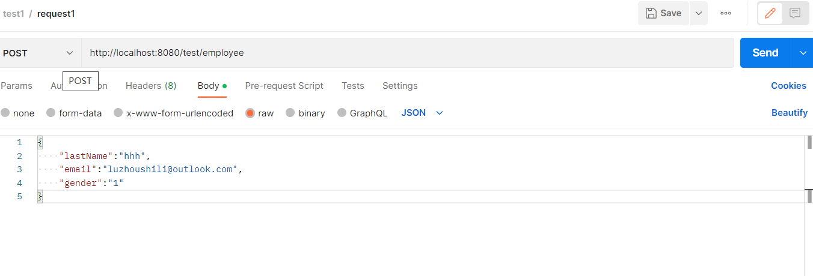

# Postman使用教程


## 创建集合

### 新建一个collection

  


### 新建一个请求 默认get

  

### 举例测试get请求

**后端controller代码，该功能是查询所有信息**

```java
//     查询所有员工信息
    @RequestMapping(value = "/employee",method = RequestMethod.GET)
    public String getAllEmployee(Model model){
//         调用dao中的方法  查询所有的员工信息
        Collection<Employee> all = employeeDao.getAll();

        // 要在浏览器中显示信息  需要将查询出来的结果  放到域对象中
        model.addAttribute("employeeList",all);

        // 将数据转发到 employee_list.html中
        return "employee_list";
    }

```


**然后使用postman进行测试,输入url,不要携带参数，然后点击send**




**测试的结果，Body表示返回的ResponseBody**

  


**状态200表示请求成功**
  


### 测试Post请求

**后端controller代码，添加一个employee对象**


```java
     @RequestMapping(value = "/employee",method = RequestMethod.POST)
    public String addEmployee(Employee employee){
         //     添加功能 Post请求  提交form表单 将form表单元素填充到employee对象
         employeeDao.save(employee);// 调用dao对象存储
//          返回列表页面
         return "redirect:/employee";
     }
```

**注意参数再body里面填写参数，这里的参数是form表单参数，里面的所有元素最后会被填充到employee对象中**

  

**填写完参数之后**

  

**可以看到添加了一个employee对象，最后一行**

  


**同时上面的实例对象也可以使用Json格式进行传参**

  


